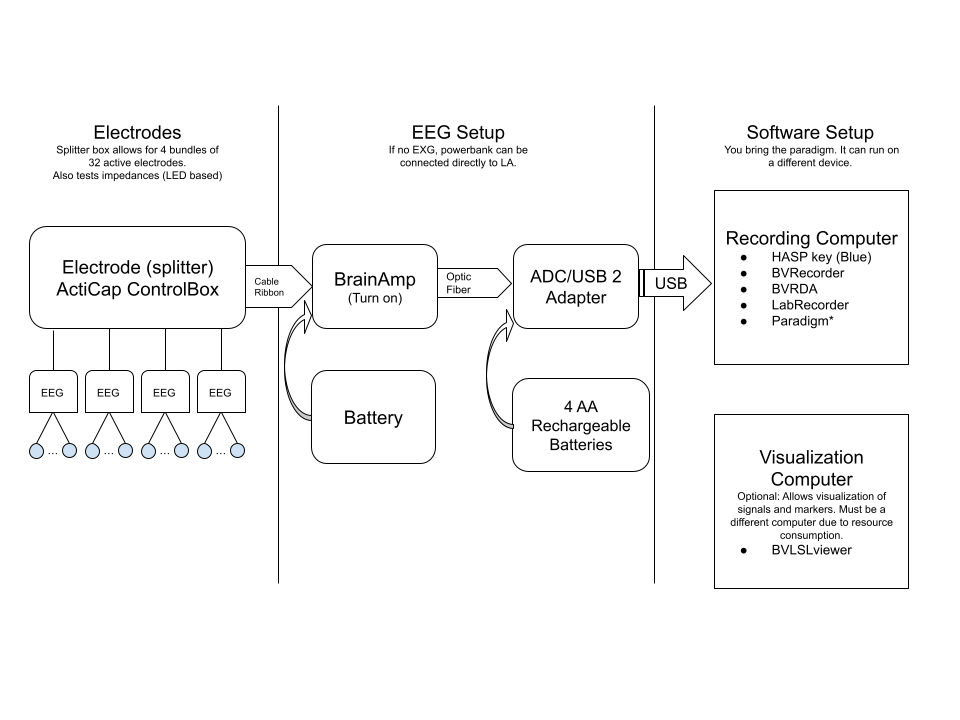

# BrainAmp (BA) Measurement checklist

The following diagrams and checklists can help you setup your experiment consistently. If you have any observation or suggestion please open an issue or make a PR.

### Layouts

Different layouts can be designed to use with the EasycapM1 cap. This is the cap with predefined wholes for electrode placement. It looks as follows: 

No current default layout for BrainAmp.

### Preparation

- Print your EEG layout
- Charge batteries: 4 AAA bateries available at the lab.
- Make sure electrodes are available and clean.
- Check you have the consumables you need:
  - Conductive gel and syringes
  - Alcohol and cotton swabs
  - *EOG stickers
  - *ECG stickers
  - Paper towels (to clean up extra gel)
  - *Masks and latex gloves if needed.
- Measure your participant's head. We have three cap sizes: 54, 56, 58
- Prepare the adequate cap with the electrodes.
- Check the necessary USBs are available: HASP key for software (Purple/Blue)

Optional Ext:
- Prepare your external electrodes: ECG, GSR, etc.

### Measurement

- Place the cap:
  1. Measure the distance from Nasion to Inion. Cz should be in the middle.
  2. Measure the distance from ear to ear. Cz should be in the middle.
  3. Look at the participant from the front. Does it look symmetric?
  4. Connect the Amplifier and turn it on.
- Start the software:
 - BrainVision Recorder (Requires HASP key): This software reads data from the BrainAmp. In preferences, RemoteDataAccess should be enabled. Make sure your layout is set correctly in the workspace.
 - BrainVisionRDA: This sends data from BVRecorder through an LSL stream.
 - LSLRecorder: Records LSL streams into XDF format.
 - Your Paradigm: the experiment you prepared for presenting stimuli and instructions to your participants.
- TODO: impedance check with active electrodes requires setup. ~~Place gel in electrodes. With the impedance view open in BVRecorder, use the syringes to place a bit of gel in the cap. Correct until impedance levels on BVRecorder are lower than your selected threshold. Start placing gel in ground GND and reference REF electrodes.~~
- Check the signals at 20 uV. Do they look like normal EEG? is there noise from the power line? Is there muscle noise?
- Ask your participant to produce artefacts: teeth clenching, blinking, moving eyes, swallowing.
- Leave the signals visible on BVRecorder (otherwise BVRDA won't send data)
- (optional EXG): Setup your external electrodes.
- Link BVRDA
- Start your protocol.
- Verify all your streams appear in LSL LabRecorder.
- Check any experiment requirements.
- Start recording.

### Clean up
- Remove cap and ensure your participant has all they need to clean their hair.
- Take material upstairs to the sink:
 - Syringes and needles
 - Cap and electrodes
- Separate cap and electrodes.
- Disinfect cap.
- Wash electrodes with water and a toothbrush.
- Wash syringes and needles with water.
- Wash off disinfectant from cap, and dry with a towel.
- Bring everything back to the fNIRS/VR lab.
