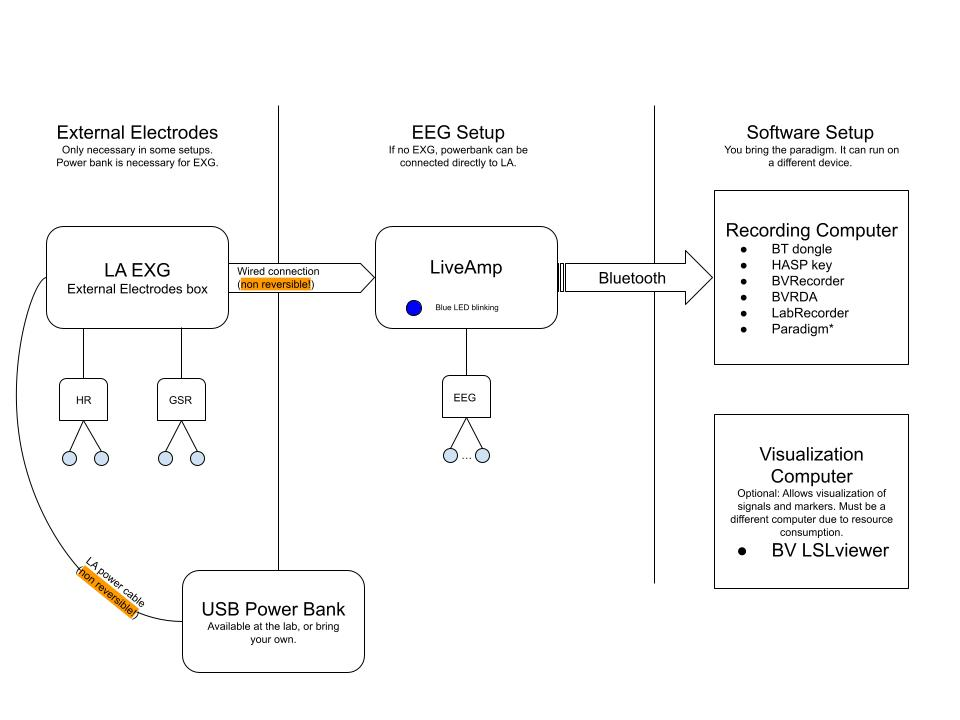

# LiveAmp (LA) Measurement checklist

The following diagrams and checklists can help you setup your experiment consistently. If you have any observation or suggestion please open an issue or make a PR.

### Layouts

Different [[Layouts]] can be designed to use with the EasycapM1 cap. This is the cap with predefined wholes for electrode placement. It looks as follows: 

Some layouts used in previous experiments can be found as their [[BrainVision Recorder Workspace]]. For most projects, the [[`LiveAmpDefault.rwksp` ]]workspace should be adequate.

## Protocol
Take a look at the [[Default LA Protocol]]:

![[Default LA Protocol]]